<p align="center">
  
</p>

<h1 align="center">LoopFlow</h1>

<p align="center"><b>An open, natural-language DSL for self-correcting AI coding loops.</b><br/>Describe what an AI coding agent should build and how to verify it in plain English, press ▶, and it loops until the check passes — a self-correcting alternative to one-shot prompts, on Claude Code, Cursor, or Copilot.</p>

<p align="center"><i>Stop babysitting the agent. Write the goal once — the loop plans, acts, reflects on red,<br/>and stops only when the check is green, at the gates you set.</i></p>

<p align="center"></p>

<p align="center">
  <a href="LICENSE"></a>
  <a href="https://www.npmjs.com/package/@loop-lang/loop"></a>
  <a href="https://marketplace.visualstudio.com/items?itemName=Loop-Lang.loopflow"></a>
  
</p>

---

<p align="center">
  <a href="https://loopflow.live"><b>📖 Read the tutorial → loopflow.live</b></a>
</p>

<p align="center">
  <a href="https://loopflow.live">Tutorial</a> ·
  <a href="https://loopflow.live/playground.html">⚡ Playground</a> ·
  <a href="https://loopflow.live/workshop.html">🛠️ Workshop</a> ·
  <a href="https://loopflow.live/game.html">🎮 Lab</a> ·
  <a href="https://github.com/tickets-forge-dev/loop-lang/blob/master/docs/MANUAL.md">Manual</a> ·
  <a href="https://loopflow.live/keywords/index.html">Keywords</a> ·
  <a href="docs/FAQ.md">FAQ</a>
</p>

## Quickstart

Requires Node 18+ and the [Claude Code CLI](https://docs.anthropic.com/en/docs/claude-code) — full install options in the [manual](docs/MANUAL.md#2-install).

```bash
npx @loop-lang/loop init      # /loopflow skill + AGENTS.md + the loop-first default (add --cursor / --copilot for other agents)
```

That last piece means **you usually don't type `/loopflow` at all**: `init` drops a gated
default into CLAUDE.md, so when you ask for something *repeatable and verifiable* ("fix this
flaky test until it's reliably green"), Claude reaches for a `.loop` on its own — while
one-off questions and trivial edits are done directly, no loop ceremony. The gate is
AGENTS.md's four-condition test; `/loopflow` stays the explicit override in both directions:

```
/loopflow fix the failing test — done when the suite passes
/loopflow run examples/fix_test.loop   # name a .loop file and it runs natively in the session
```

Copy `.claude/skills/loopflow/` to `~/.claude/skills/` to use the skill in any repo. Don't write your first loop from scratch — [start from a template](https://loopflow.live/#templates) and edit the goal + `done when`. Full walkthrough at **[loopflow.live](https://loopflow.live)**.

## Why

AI writes the code now. But you're still the conductor — kicking off manual pass after manual pass: *"fix the security issues", "now refactor", "now fix the UI."* Even strong methods leave you iterating by hand, in layers, forever.

LoopFlow lets you describe that **movement once**. You don't type the app — you type the *loop*: the five decisions (objective, context, actions, verification, stopping) that today are buried in a prompt. LoopFlow makes them first-class, editable, and shareable; at run time they drive five phases — plan → act → observe → reflect → stop. The [tutorial](https://loopflow.live/#what) teaches the framing.

## A taste

```loop
loop "fix billing apostrophe bug":
  goal: settings save when the company name has an apostrophe
  done when the test "billing.spec.ts::apostrophe" passes

  look at: billing/form.tsx, api/settings.ts, schema/settings.ts, and the last failure
  allow edits automatically, but ask me before migrations or pushes

  each cycle: plan, then act, then observe
  when it passes and the goal is met:  stop
  when it fails:                        reflect on which layer broke, then plan again
  when blocked:                         ask a human
  after 6 tries:                        stop and warn "thrashing"
```

## Compose loops

Compose loops into **pipelines** (stages in order, fail-fast), chain whole files with **`flow`**, and fan out over a plan with **`for each`** — humans wired in where judgment lives. Full grammar with worked examples: the [tutorial](https://loopflow.live) and the [manual](docs/MANUAL.md).

## Verify like you mean it

`done when` is the loop's definition of reality. List several checks (**all must pass**), mix deterministic tests with LM-judged evals, and harden both against false greens:

- `done when "pnpm test checkout" passes 3 times` — **flake guard**: one lucky green isn't "done".
- `done when the skill "code-review" approves by 3 judges` — **judge panel**: majority of 3 independent verdicts; one wobbly LM judgment isn't "done" either.
- `done when the skill "path-review" approves on the trajectory` — **trajectory eval**: catches what a green test can't — an agent that gamed the check.

Taught with a worked example in the [tutorial](https://loopflow.live/#evals); full mechanics (working dir, shell env, exit codes) in [How verification works](docs/MANUAL.md#how-verification-works--what-done-actually-depends-on).

## Skills and memory

A loop can use skills through one `skills:` keyword:

```loop
skills: auto                         # discover/add useful skills with minimum friction
skills: ask                          # recommend additions, ask before adding
skills: fixed, seo-audit             # use only these explicit skills
skills: none                         # use no skills
skills: auto, seo-audit              # start with seo-audit, auto-add more if useful
```

`auto` runs an early capability check before implementation. It may use installed skills, trusted installable skills, or temporary generated skills, and it logs what it added. It only interrupts for risky actions such as untrusted sources, broad capabilities, or permanent generated skills. Existing `use skills:` loops still work, but `skills:` is preferred. A review skill can still be the verdict (`done when the skill "workout-review" approves`), and cross-run memory still lives in markdown (`remember in "morning-run.memory.md"`). Details: [manual](docs/MANUAL.md#inside-a-loop--stage-body), [`examples/skills_memory.loop`](examples/skills_memory.loop).

## The vocabulary — learn it once

`pipeline` · `stage` · `loop` · `flow` · `for each … in …` · `run … then …` · `each cycle` · `goal` · `done when` · `look at` · `allow…/ask me before…` · `also` · `skills` · `remember in` · `when…` · `reflect` · `a human…` · `stop` · `use` · `schedule` · `git`

Power comes from **composition**, not keyword count. Each word is documented at [loopflow.live/keywords](https://loopflow.live/keywords/index.html); the authoritative grammar is [AGENTS.md](AGENTS.md).

## Git strategy (safe by default)

Without a `git:` block, LoopFlow works on a branch and commits when the goal is met — it **never pushes to `main` or `master`** (unconditional, not configurable). A `git:` block opts into push and a pull request: all line forms and cascade rules in the [manual](docs/MANUAL.md#git-strategy), working file at [`examples/git_policy.loop`](examples/git_policy.loop).

## Authoring: by hand or by agent

By hand: the [**LoopFlow VS Code extension**](https://marketplace.visualstudio.com/items?itemName=Loop-Lang.loopflow) (`ext install Loop-Lang.loopflow`) gives highlighting, completions, hover docs, and squiggles. By agent: drop [AGENTS.md](AGENTS.md) in your repo and any assistant authors `.loop` from a plain-English request — feature details in the [manual](docs/MANUAL.md#7-vscode-extension).

## Run it headless

The `loop-run` CLI ships with `npm i -g @loop-lang/runtime`:

```
loop-run run file.loop --live          # real-time browser dashboard of the run
loop-run run file.loop --log run.log   # NDJSON event log (secrets scrubbed)
loop-run run file.loop --resume run.log  # skip what the log proves done; pick up where it died
loop-run show file.loop                # sanity-check the shape as ASCII before spending tokens (explain = plain English)
```

In-session, the dashboard is opt-in: set `live=true` in `loop.config` (`loop init` writes it with `live=false`). Log format, redaction, resume semantics, and the `LOOP_EVENTS_URL` remote collector: [Event log & telemetry](docs/MANUAL.md#event-log--telemetry).

## Project layout

| Package | Purpose |
|---|---|
| `@loop-lang/parser` | `.loop` text → `loop-spec` JSON (the open IR) |
| `@loop-lang/runtime` | walks a spec, drives Claude Code, emits a live trace |
| [`loopflow` (VS Code)](https://marketplace.visualstudio.com/items?itemName=Loop-Lang.loopflow) | highlight, diagnostics, completion, templates, ▶ Run CodeLens |
| `@loop-lang/stdlib` | `BMAD.loop` + starter presets |
| `@loop-lang/viz` | `loop-run viz file.loop` → self-contained HTML schematic; also the live dashboard (`--live`) |
| `spec/loop-spec.schema.json` | the open IR contract |

## Is this just another &lt;X&gt;?

"Is this another LangChain?", "why not YAML?", "won't better models make this pointless?",
"doesn't it lock me into Claude Code?" — answered straight in the [**FAQ**](docs/FAQ.md).

## Status

Active — see the [roadmap](#roadmap) and [open issues](../../issues).

## Roadmap

- **Next** — runner abstraction (run loops on your own local/API model), a GitHub Action
  (loops as CI quality gates), a community template registry (`use someone/their-method`).
- **Later** — visual graph editor (the `loop-spec` IR is built for it), async human nodes,
  reactive stages, scheduling.

## Built with LoopFlow

LoopFlow ships real software. **Forge** — a ticket-driven implementation platform (hand it a ticket, agents implement it) — is built with LoopFlow, including its **sandbox runner**: isolated, network-less execution of agent-written code. The pipeline that built it is [`examples/forge-sandbox.loop`](examples/forge-sandbox.loop); the walkthrough is the [case study in the tutorial](https://loopflow.live/#workflows).

## Contributing

This is a **community project** and an **open standard**. Good first issues: new presets, grammar edge cases, formatter rules. See [CONTRIBUTING.md](CONTRIBUTING.md) and the [Code of Conduct](CODE_OF_CONDUCT.md).

## License

[Apache-2.0](LICENSE). The language and the `loop-spec` IR are an open standard — implement against them freely.

## Maintainer

<a href="https://www.linkedin.com/in/idan-ayalon/"></a>

**Idan Ayalon** — creator &amp; maintainer of LoopFlow. Built **Forge** with it.

📧 [bar.idan@gmail.com](mailto:bar.idan@gmail.com)  
💼 [linkedin.com/in/idan-ayalon](https://www.linkedin.com/in/idan-ayalon/)

<br clear="left" />
