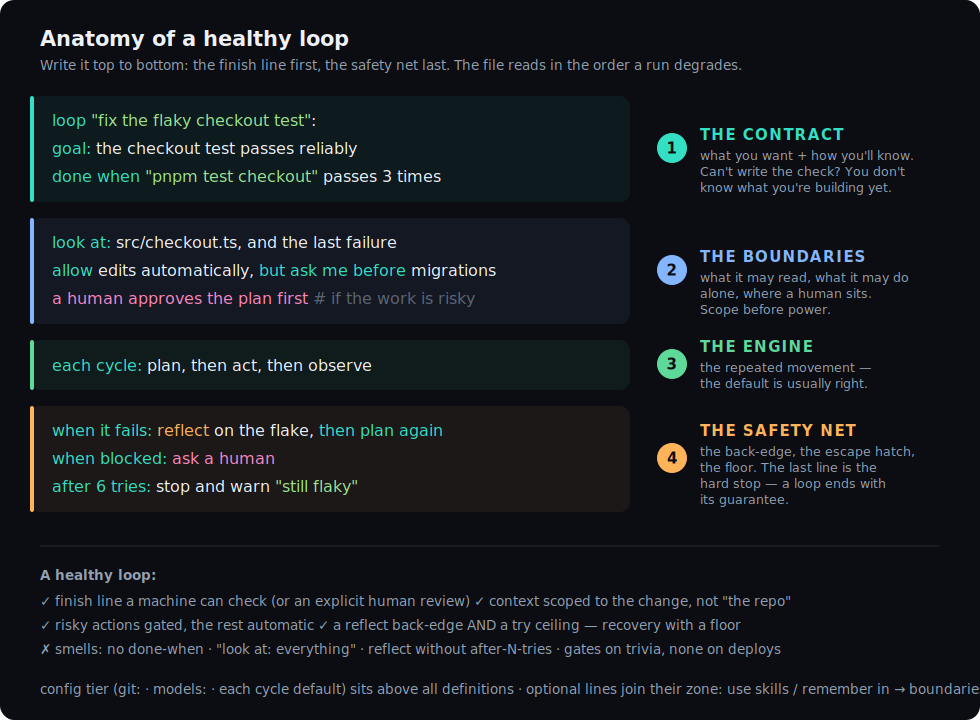

# LoopFlow — User Manual

The complete LoopFlow reference: install, CLI, language, run semantics, the IR.
New here? Start with the [tutorial](https://loopflow.live).
Authoring `.loop` with an AI agent? Give it [`AGENTS.md`](../AGENTS.md).

- [The shape of a loop](#the-shape-of-a-loop)
- [1. Requirements](#1-requirements)
- [2. Install](#2-install)
- [3. Quickstart](#3-quickstart)
- [4. The CLI](#4-the-cli)
- [5. Language reference](#5-language-reference)
  - [Git strategy](#git-strategy)
- [6. How a run works](#6-how-a-run-works)
- [7. VSCode extension](#7-vscode-extension)
- [8. Authoring with an AI agent](#8-authoring-with-an-ai-agent)
- [9. Presets (methods)](#9-presets-methods)
- [10. Troubleshooting](#10-troubleshooting)
- [11. The loop-spec IR](#11-the-loop-spec-ir)

---

## The shape of a loop

Every loop has one structure with two faces. You **author five decisions** (the knobs);
the runtime executes **five phases** (the cycle). The knobs configure the phases.

```
        what you DECIDE                     what RUNs
        (the .loop you write)               (each iteration)

        objective   →  goal:                ┌─────────────────────────────┐
        context     →  look at:             │   plan → act → observe      │
        actions     →  allow / ask me…      │     ▲              │        │
        verification → done when            │     └── reflect ◄──┘ (fail) │
        stopping    →  when… / after N      └──────────── │ ──────────────┘
                                                     (pass) ▼
                                                          stop
```

| Knob | The line | Configures the phase |
|---|---|---|
| Objective | `goal:` | what `stop` is aiming at |
| Context | `look at:` | what `plan` may read |
| Actions | `allow … / ask me before …` | what `act` may do |
| Verification | `done when …` | what `observe` checks |
| Stopping | `when …` / `after N tries` | `stop` + the `reflect` back-edge |

Defaults cover the simple case (cycle `plan → act → observe`; edits auto). The
[VSCode extension](#7-vscode-extension) warns — never errors — when a loop is missing
something load-bearing.

## Anatomy — the authoring order

The parser doesn't care what order the lines come in; you should: **the finish line
first, the safety net last** — four zones, top to bottom. (Rationale and the taught
version: [tutorial → Anatomy](https://loopflow.live/#anatomy).)

<p align="center"></p>

### The four zones, in writing order

| # | Zone | Lines | Why it comes here |
|---|---|---|---|
| 1 | **The contract** | `goal:` → `done when` | The check before any behavior — loop engineering's TDD. |
| 2 | **The boundaries** | `look at:` → `allow …, ask me before …` → `a human approves/reviews …` | Scope before power; decide gates while thinking about risk. |
| 3 | **The engine** | `each cycle:` | The repeated movement. |
| 4 | **The safety net** | `when it fails:` → `when blocked:` → `after N tries:` | Recovery → escape hatch → floor; the last line is the hard stop. |

The canonical skeleton (placeholders — replace every `<…>` before running; it does not parse as-is):

```loop
loop "<name>":
  goal: <the outcome, one sentence>                    # 1 ── contract
  done when <a check a machine can run>                #      the finish line — write it FIRST

  look at: <the few files that matter>, and the last failure   # 2 ── boundaries
  allow edits automatically, but ask me before <the risky class>
  a human approves the plan first                      #      (only when the work warrants it)

  each cycle: plan, then act, then observe             # 3 ── engine

  when it fails: reflect on <what to examine>, then plan again  # 4 ── safety net
  when blocked:  ask a human
  after 6 tries: stop and warn "<how you'll find it stuck>"     #      the floor, always last
```

**Where the optional lines go** — each joins the zone it belongs to:

| Line | Zone |
|---|---|
| `skills:` / `use skills recommended by ctx` / `remember in` / `knowledge:` / `examples:` | 2 · boundaries (capabilities & context) |
| `plan from "<file>"` | 2 · boundaries (the plan is an input) |
| `also:` (finishing passes) | 3 · engine (extra movement after the goal) |
| `hooks:` | 4 · safety net (deterministic checkpoints) |
| `git:` block, `models:` | config tier — **above** all definitions, or file-top inside the loop |

Smells, for the review pass: no `done when` · `look at:` missing or unbounded · a reflect
back-edge with no try ceiling · a `warn` message that won't tell future-you what got stuck ·
five gates on a rename. The same order applies inside every `stage` of a pipeline — each
stage is a loop and reads as one.

## 1. Requirements

- **Node.js 18+**
- The **Claude Code CLI** (`claude`) installed and authenticated — `loop-run run` drives it.
  Other commands (`parse`, `viz`) do not need it.

## 2. Install

The published packages:

```bash
npx @loop-lang/loop init         # scaffold Loop into a repo: /loopflow skill + AGENTS.md + examples + templates
                                 # + the gated loop-first default in CLAUDE.md (--cursor / --copilot for other agents; --no-claude-md to skip)
npm i -g @loop-lang/runtime      # the loop-run CLI used throughout this manual
```

Building from source (contributors):

```bash
git clone <repo-url> loop-lang && cd loop-lang
npm install && npm run build
npm link --workspace @loop-lang/runtime   # the same loop-run command, from your build
```

## 3. Quickstart

Create `fix.loop`:

```loop
loop "fix add":
  goal: the add function returns the sum of its two arguments
  done when "npm test" passes
  look at: src/add.js
  allow edits automatically
  each cycle: plan, then act, then observe
  when it fails: reflect on why it failed, then plan again
  after 5 tries: stop and warn "could not fix add"
```

Don't start from a blank file: [`templates/`](../templates/) ships verified starter loops
(bugfix, feature, security, greenfield A-to-Z) — copy one and fill in its `# TODO` lines.

Check it parses, see it, then run it:

```bash
loop-run show fix.loop       # print the loop's shape as ASCII (explain = plain English)
loop-run parse fix.loop      # prints the loop-spec JSON (validates syntax)
loop-run viz fix.loop        # writes fix.html — open it in a browser
loop-run run fix.loop        # drives Claude Code: plan -> act -> observe -> done
```

Make `show` (or `explain`) a habit before `run` — ten seconds of reading the shape catches
a missing thrash guard before it costs tokens.

`loop-run run` works in the directory the `.loop` file lives in: it plans, edits files,
runs your `done when` check, reflects on failure, and stops when the goal is met (or at
the thrash guard).

## 4. The CLI

```
loop-run <run|parse|viz|live|show|explain|ls|emit> <file.loop> [--model <alias>] [--live] [--events] [--log <path>] [--resume <log>] [--out <path>]
```

| Command | What it does |
|---|---|
| `loop-run run <file>` | Execute the flow on Claude Code (plan/act/observe, reflect, verify, human gates). |
| `loop-run parse <file>` | Parse to the loop-spec IR and print it as JSON (use to validate syntax). |
| `loop-run show <file>` | Print the loop's flow as compact ASCII (the "see the shape" view). |
| `loop-run explain <file>` | Describe the loop in **plain English** — handy for non-experts to check what a `.loop` will actually do. |
| `loop-run viz <file>` | Write a self-contained HTML schematic of the flow. |
| `loop-run ls [dir]` | List every `.loop` under a directory with its one-line shape. |
| `loop-run live <file>` | Start the live dashboard server (no engine) and stay up; for driving the dashboard from an in-session run. |
| `loop-run emit <port> '<json>'` | Push one event to a running `live` server (used by the `/loopflow` skill). |

**Flags**

- `--model <alias>` — model for `run` (e.g. `opus`, `sonnet`, `haiku`); passed to Claude
  Code. Omit to use the CLI default.
- `--live` — for `run`, open a live browser dashboard and stream every step to it as the
  loop executes (see below).
- `--events` — for `run`, emit the machine-readable NDJSON event protocol on stdout for a
  UI host (what the VSCode ▶ Run "output" mode consumes).
- `--log <path>` — for `run`, append the full event stream to a local NDJSON log
  (see **Event log & telemetry** below). Overrides `LOOP_LOG_FILE`.
- `--resume <log>` — for `run`, skip everything a prior run's event log proves already
  satisfied and pick up at the first incomplete unit (see **Resuming an interrupted run**).
- `--out <path>` — for `viz`, the HTML output file (default: the `.loop` name with an
  `.html` extension).
- `--json` — print the parsed loop-spec JSON before the command's normal work (handy with
  `run`; also works with `viz`). For `parse`, the JSON is the entire output.

**Config files.** A `.loop` file containing only a config block with `use` (and no
definitions) resolves the named preset and runs it — e.g. a `project.loop` with
`use the BMAD method`.

### Live dashboard

A real-time browser view of a run: the loop's **actual structure** as a turn-by-turn route
(pipeline stages / flow steps / for-each items), with a "you are here" marker, the steps
ahead, human gates flagged, and for-each sprints listed by item title with N/total progress.

Two ways to drive it:

- **Headless** — `loop-run run <file> --live` opens a browser tab and the engine streams
  every event to it. The terminal still prints the normal text trace.
- **In-session** — opt-in via `loop.config`: `loop init` writes `live=false`; only
  `live=true` makes the `/loopflow` skill open and drive the dashboard. Independent of the
  headless `--live` flag. (The emit protocol the skill uses is specified in the skill's own
  cheat-sheet.)

The page connects over Server-Sent Events; each event carries an id and the server replays
on connect (and dedupes on reconnect via `Last-Event-ID`), so events fired before the browser
connects are not lost and a transient drop doesn't double-deliver. The dashboard is
self-contained (no external assets) and binds to `127.0.0.1` only.

### Event log & telemetry

Every meaningful thing a run does is a **structured event** — `loop-start`, each
`node-enter` / `node-exit` (with the attempt number), `observe` (pass/fail + output),
`transition`, `reflect`, `loop-back`, human gates, `ctx` provision/top-up, `git` actions,
`hook` results, the `model` tier per phase, `stop` (with the reason), `loop-end`, and the
pipeline / flow / for-each envelopes. The live dashboard renders this stream; you can also
**persist it** — to a local file and/or a remote collector — for auditing, debugging a
thrashing loop, or metering cost.

**Off by default.** With no flag and no env var, a run persists nothing and behaves exactly
as before. Persistence is **best-effort**: a failing log or an unreachable collector never
throws and never blocks a run — telemetry can't break a loop.

#### Local log — `--log` / `LOOP_LOG_FILE`

```bash
loop-run run test.loop --log run.log          # one-off (overrides LOOP_LOG_FILE)
LOOP_LOG_FILE=run.log loop-run run test.loop  # env — same effect
```

The log is **NDJSON**: one JSON object per line, so it streams and greps cleanly. The first
line is a `loop.log.v1` header (the run id + metadata); every line after is one event with a
monotonic `seq` and an ISO timestamp:

```jsonc
{"v":"loop.log.v1","runId":"…","ts":"2026-07-01T20:04:43.443Z","meta":{"loop_path":"test.loop","principal":"idan"}}
{"seq":0,"ts":"…","event":{"type":"loop-start","name":"test loop"}}
{"seq":1,"ts":"…","event":{"type":"node-enter","node":"plan","attempt":1}}
{"seq":2,"ts":"…","event":{"type":"observe","passed":false,"output":"1 failing test"}}
{"seq":3,"ts":"…","event":{"type":"reflect","focus":"which layer broke","text":"the API returned 500"}}
{"seq":4,"ts":"…","event":{"type":"stop","reason":"done"}}
```

Each event is written with a synchronous append, so it's on disk the instant it fires — the
log survives a `Ctrl-C` or a crash with **no lost tail**. The parent directory is created if
missing. It works the same across all run modes (default, `--live`, `--events`).

**Secrets are scrubbed before anything is persisted.** Command output can echo credentials
(a failing `git push` printing a token, a dumped env). Every event passes through a redactor
before it reaches the file log or the HTTP collector: values of env vars whose *names* look
secret-bearing (`*_TOKEN`, `*_SECRET`, `*_PASSWORD`, `*_KEY`, …) are replaced with
`[redacted:<VARNAME>]`, and well-known credential shapes (GitHub / Slack / AWS / `sk-…` API
keys, JWTs, PEM private keys, `Bearer …` headers, `password=…` assignments) are masked by
pattern. Best-effort by design — treat it as a seatbelt, not a licence to log freely. Disable
with `LOOP_REDACT=off` (e.g. when debugging the redactor itself).

Read it back with any NDJSON tool — e.g. with `jq`:

```bash
jq 'select(.event.type == "observe")' run.log            # every verification result
jq -r 'select(.event.type=="reflect") | .event.text' run.log   # what each failure taught it
jq 'select(.event.type == "stop") | .event.reason' run.log     # how it ended
```

#### Remote collector — `LOOP_EVENTS_URL`

To stream the same events to a control plane over HTTP, set `LOOP_EVENTS_URL` (and, if the
collector needs it, `LOOP_EVENTS_TOKEN`). Events POST to
`<url>/api/v1/runs/<runId>/events`, each carrying the monotonic `seq` so the server is
idempotent on retries and out-of-order delivery.

| Env var | Meaning |
|---|---|
| `LOOP_LOG_FILE` | Local NDJSON log path (the `--log` flag overrides it). |
| `LOOP_EVENTS_URL` | Control-plane collector base URL — enables the HTTP sink. |
| `LOOP_EVENTS_TOKEN` | Shared API token, sent as `x-api-token` (optional). |
| `LOOP_RUN_ID` | Correlate a run's events across sinks (optional; a UUID is generated if unset). |

The file log and the HTTP collector can run **together** — the same event fans out to both,
sharing one `runId`, so a local trace and the control-plane record line up. Set `LOOP_RUN_ID`
yourself when you want a run's id to match something you already track (a CI job, a ticket).

### Resuming an interrupted run — `--resume`

The event log is also a **journal**. A long pipeline that dies at stage 4 — crash, `Ctrl-C`,
laptop lid — doesn't have to start over:

```bash
loop-run run epic.loop --log run.log          # …dies at stage 4 of 6
loop-run run epic.loop --resume run.log --log run.log   # stages 1–3 skip, stage 4 picks up
```

What resume does:

- **Skips what's proven done.** A unit whose end event says `satisfied: true` in the log —
  a whole definition, a pipeline stage, a flow step, a `for each` item — is skipped, with a
  `⏩ resumed` line in the trace. Everything else (failed, or interrupted mid-flight with no
  end event) re-runs from scratch.
- **Restores flow context.** A flow step's handoff summary is recorded on its end event, so
  a resumed flow hands the *next* step the same carry-forward text the original run produced.
- **Detects drift.** The log header carries a hash of the `.loop` source; if the file changed
  since the logged run you get a warning (units are matched by name/position). Editing the
  file to *fix* the failing stage and then resuming is the normal workflow — the warning is
  informational, not an error.
- **Composes with `--log`.** Point `--log` at the same file to keep one continuous journal
  (headers separate the runs), or at a new file for a clean second record. Nested work needs
  no bookkeeping: a sub-file a flow step runs is summarised by that step's own end event.

The unit of resume is deliberately the *stage / step / item*, not the mid-loop cycle — a
half-finished loop re-verifies from its own `done when`, which is exactly what makes skipping
safe: nothing is trusted that a check didn't prove.

## 5. Language reference

A `.loop` file is indentation-structured. `loop` / `pipeline` sit at column 0; their body
is indented two spaces; a `stage`'s body is indented under the stage. Comments start with
`#`.

### Definitions

- **`loop "<name>":`** — a single self-correcting loop. Requires a `goal`.
- **`pipeline "<name>":`** — a sequence of stages. Requires at least one `stage`. Stages
  run in order; a failing stage halts the rest. (An epic → a pipeline.)
- **`stage "<name>":`** — one stage of a pipeline; its body is a loop. (A story → a stage.)
- **`flow "<name>":`** — a chain of `.loop` files. Each step runs a whole file and passes
  its text result forward. Fail-fast: a step that ends unsatisfied stops the rest.

### Chaining loops across files (`flow`)

A `flow` lets you sequence independent `.loop` files into a single pipeline where the
output of one step becomes the context for the next. This is useful when each phase lives
in its own file and should be reusable independently:

```loop
flow "ship":
  run "build.loop"
  then run "test.loop"
  then run "deploy.loop":
    a human approves first
```

| Element | Meaning |
|---|---|
| `run "<file>"` | First step. Runs the whole file (plan→act→observe); text result is carried forward. |
| `then run "<file>"` | Subsequent step. Automatically receives the previous step's text summary as upstream context. |
| `a human approves first` | Optional per-step human gate — blocks until approved before the step runs. |
| `with the result of <name>` | Reference a specific named step's output instead of the automatic carry. |

**Text handoff.** Only the text summary (the last observe output or final plan) is passed
between steps — not file state. File edits made by one step are visible to the next
through the working directory as normal; the explicit channel is the text summary.

**Fail-fast.** If any step ends unsatisfied, the remaining steps are skipped and the flow
ends unsatisfied.

### Iterating over a plan (`for each`)

Inside a `flow`, `for each` reads a list from a YAML or Markdown file and runs a template
once per entry. Each entry's text becomes the template's context — what to build.

```loop
flow "deliver":
  for each item in "plan.yaml":
    run "item-template.loop"
```

| Element | Meaning |
|---|---|
| `for each <var> in "<file>":` | Read items from the file; run the body once per item. |
| `run "<template>"` | Template to run per item; the item text arrives as context. |
| Source `.yaml` | A flat list or a single-key list (e.g. `items:`). |
| Source `.md` | Splits on `## ` headings — each section is one item. |
| Failed item | The flow pauses and asks whether to continue with the next item or stop. |

**A-to-Z with any method.** `for each` is method-neutral. The same syntax works whether
the template is a BMAD story checklist, a security scan, a documentation pass, or anything
else. See [`examples/foreach/`](../examples/foreach/) for a generic bundle (implement →
security → lint, per work item) and [`examples/bmad/atoz/`](../examples/bmad/atoz/) for a
BMAD flow (discover → design → for each story) as one example method.

### Inside a loop / stage body

| Line | Meaning |
|---|---|
| `goal: <text>` | The objective, in plain language. **Required.** |
| `done when <predicate>` | How the loop verifies itself (see Predicates). **You can list several — all must pass** (a conjunction of tests and evals). Omit only if a human gate decides completion. |
| `look at: <a>, <b>, and the last failure` | Context the agent reads before acting. Items are file paths or plain-language descriptions (e.g. `the billing form`) — the agent locates the actual files from descriptions before planning. `and the last failure` feeds the previous failure forward. |
| `allow edits automatically, but ask me before <classes>` | Action policy. Auto classes run unattended; confirm classes pause for you. Classes: `edit`, `migrate`, `push`, `deploy`, `delete`. |
| `each cycle: plan, then act, then observe` | The repeated steps — any subset of `plan` / `act` / `observe`, in order. |
| `also: <pass>, <pass>` | Extra finishing passes run **after** the goal is met (skipped on failure). |
| `skills: auto \| ask \| fixed, <a>, <b> \| none` | Unified skill policy. `auto` may add useful skills with minimum friction; `ask` recommends additions but asks before adding; `fixed` uses only listed baseline skills; `none` disables skills. Explicit names after `auto`/`ask`/`fixed` are baseline skills. |
| `remember in "<file.md>"` | Cross-run memory: read the file's lessons into the first plan, append a dated outcome entry on stop. (`keep a memory in "<file>"` also works.) |
| `when it passes and the goal is met: stop` | Success transition. |
| `when it fails: reflect on <focus>, then plan again` | The feedback edge — reflect, then re-enter the cycle. |
| `when blocked: ask a human` | Pause for a person when stuck. |
| `after <N> tries: stop and warn "<msg>"` | Thrash guard — stop after N attempts. |
| `a human approves the plan first` | A person approves the plan before the agent acts. |
| `a human reviews before stopping` | A person judges the result before the loop may stop. |
| `plan from "<file>"` | Read the loop's plan from a file you control (e.g. a hand-written `.md`) instead of having the agent generate it. Omit it and the agent writes the plan (the default). |

### Friendly shorthands

Plain-English synonyms for the lines above — write whichever reads naturally to you. They
desugar to the exact same loop-spec, so you never lose any power:

| Shorthand | Same as |
|---|---|
| `check: pnpm test` | `done when "pnpm test" passes` (a bare value is a shell command) |
| `check: the skill "review" approves` | `done when the skill "review" approves` (a predicate phrase is parsed as-is) |
| `verify: …` | same as `check:` |
| `in: src/cart, src/tax` · `files: …` · `look in: …` · `context: …` | `look at: …` |
| `when it breaks: …` | `when it fails: …` |
| `when it gets stuck: …` | `when blocked: …` |

A complete, friendly loop can be as short as:

```loop
loop "fix the cart total":
  goal: the cart total is correct with tax
  in: src/cart, src/tax
  check: pnpm test cart
  when it breaks: reflect, then plan again
  after 6 tries: stop and warn "stuck"
```

Run `loop-run explain <file>` to read any loop back in plain English and confirm it does
what you intend.

### In a stage only

| Line | Meaning |
|---|---|
| `a human approves before <action>` | A blocking gate before the stage runs (e.g. before deploy). Parses in any loop body, but only a `stage` acts on it — in a standalone `loop` it is silently ignored. |

### Predicates (`done when …`)

Every form, in one (deliberately over-checked) loop body:

```loop
loop "predicate forms":
  goal: one example of every done when form
  done when the test "billing.spec.ts::apostrophe" passes   # a named test
  done when "pnpm test" passes                               # shell command, exit 0 (`succeeds` also works)
  done when "semgrep --severity=high" finds nothing          # shell command, empty stdout
  done when "pnpm test flaky" passes 3 times                 # flake guard: re-run, every run must pass
  done when a human confirms "looks right at 375px"          # a human check
  done when the skill "email-review" approves                # an eval: approved / not
  done when the skill "email-review" scores 8 or more        # an eval: numeric threshold
  done when the skill "code-review" approves by 3 judges     # judge panel: N verdicts, majority wins
  done when the skill "api-review" scores 8 or more on the output       # an eval of WHAT was produced
  done when the skill "path-review" approves on the trajectory          # an eval of HOW it got there
    the bar: didn't weaken a test to go green; no writes outside api/   # the rubric the judge scores against
```

The command runs in your shell with your privileges (like an npm script). Keep it fast
and deterministic.

**Flake guard — `passes N times`.** Append `N times` to a `test` or command predicate
(`passes` / `succeeds` / `finds nothing`) to re-run the check `N` times and require **every**
run to pass. The first failing run short-circuits (the rest don't execute). Use it when a
green can hold by luck — a timing-dependent or order-dependent test — so "done" means
"passes *reliably*", not "passed *once*". `show` renders it as `×N`; a plain check (or
`1 time`) is the usual single run.

**Judge panel — `by N judges`.** Append `by N judges` to a skill predicate to collect `N`
independent verdicts and take the **majority**. A single LM judge wobbles run-to-run near the
bar; independent samples average the noise out. The panel early-exits once the vote is
mathematically decided (2 approvals out of 3 → the third judge never runs), each verdict is
emitted as its own `skill-verify` event (`judge 1/3: …`), and the observe output reports the
tally (`judges: 2/2 approved (majority of 3 reached)`). Composes with everything else:
`scores 8 or more on the trajectory by 5 judges`. Costs N× the eval, so reserve it for
checks where a wrong "done" is expensive.

#### Tests vs evals

A loop can list **several `done when` lines, and all must pass.** Use this to combine the
two kinds of verification:

- **Tests** — `test` / command predicates. Deterministic, checked by code.
- **Evals** — `skill` predicates. A rubric / LM judge for the non-deterministic parts. An
  eval names its **subject**: `on the output` (the default — judges *what* was produced) or
  `on the trajectory` (judges *how* the agent got there — its path and tool calls). An
  indented `the bar:` line states the conditions the judge must score against.

A trajectory eval catches what a green test can't — e.g. an agent that made a test pass by
weakening it. Pair a test with an eval when "done" means both *it works* and *it was built
the right way*. Build the review skill manually first and confirm it judges well, then wire
it in. See `examples/skills_memory.loop` and `examples/email_review.loop`.

#### How verification works — what "done" actually depends on

When the loop says "done", what exactly decided that? End to end:

**When it runs.** Verification happens at the **observe** node of every cycle — after act,
before any transition. Nothing is verified mid-act; a cycle without `observe` in its
`each cycle:` never checks at all (it relies on a human gate to stop).

**The conjunction.** Every `done when` line must pass, in the order written. The **first
failing check short-circuits** — later predicates don't run that cycle. Their combined output
becomes the observe result; on failure that text is *"the last failure"* your `look at:`
context refers to, and it feeds the `reflect` step. Verification isn't just a gate — it's the
loop's sensory input.

**Where a command runs.** A `test` / command predicate runs
as a real shell command:

| Factor | Effect on the verdict |
|---|---|
| **Working directory** | The loop's effective `baseDir` — your repo dir by default, the `target:` dir if the config sets one, and **the worktree** when the git policy is `work in a worktree`. A check that passes in-repo can fail in a fresh worktree (untracked files, unbuilt artifacts). |
| **Your shell + your env** | The command runs with *your* privileges and environment, like an npm script. A `PATH`, `NODE_ENV`, or missing env var difference between your machine and CI changes the verdict. |
| **Exit code** | `passes` / `succeeds` = **exit 0**. Nothing else is inspected. A test runner configured to exit 0 on failures will make the loop lie to you — verify your runner's exit-code behavior first. |
| **Output emptiness** | `finds nothing` = exit 0 **and** empty stdout+stderr. A scanner that prints a benign banner never "finds nothing" — silence it or wrap it. |
| **The `test` shorthand** | `the test "x::y" passes` desugars to `npm test -- x::y` by default. If your runner isn't npm-style, use an explicit command predicate instead. |
| **Flakiness** | One lucky green = done, unless you add `passes N times` (every run must pass, first failure short-circuits). |
| **Output size** | Captured output is truncated (~4 kB into the trace) — the verdict uses the exit code, not the text, so truncation never changes pass/fail. |

**How an eval decides.** A skill predicate never touches the shell — it's routed to the
runner, which invokes the named review skill as a judge. What the judge sees is the
**subject**: the act summary (`on the output`, default) or the captured path and tool calls
(`on the trajectory`). It scores against the `the bar:` rubric if present; `scores N or more`
compares its numeric score to the threshold; `by N judges` repeats the judgment independently
and takes the majority. An eval's verdict is an LM's judgment — it can wobble; the bar and the
panel are the two tools that stabilize it.

**What never auto-passes.** `a human confirms "…"` always waits for you. A loop with **no**
`done when` at all can never be machine-satisfied — it needs `a human reviews before stopping`,
or it runs until the `after N tries` guard / the hard cap (25 cycles) stops it unsatisfied.

**What the verdict triggers.** Pass + goal met → the loop stops (then `also:` finishing passes,
then a human review if declared — and an `on stop` hook can still **veto** the stop). Fail →
the `when it fails:` transition (reflect → plan again). So the checks you write are literally
the loop's definition of reality: a wrong predicate doesn't make the loop fail — it makes the
loop *stop caring about the right thing*.

**Rules of thumb.** Fast, deterministic, loud-on-failure commands; `finds nothing` for
scanners; `passes N times` for anything with timing in it; a test **and** an eval when "done"
has a quality dimension; a trajectory eval when you're worried the agent will game the test.

### Config tier (top of file)

```loop
use the BMAD method      # pull in a preset (a .loop in the stdlib, or ./local.loop)
run with claude code     # runner / provider (or: `runner claude code`)
schedule: nightly        # manual · nightly · on push · cron (parsed; run is manual via the CLI)
target: ./src            # working directory the loop operates in
notify: slack            # parsed and stored in the IR; NO runtime behavior yet (reserved)
each cycle: plan, then act, then observe   # the DEFAULT cycle for every loop in the file
```

Anything in the config tier is a **default for every loop in the file**, so you write it
once instead of repeating it per loop. A `each cycle:` here is inherited by every loop; a
loop with its own `each cycle:` overrides it. The same lowest-wins cascade governs `git:`
and `models:`.

#### Project defaults — `loop.config`

To avoid repeating config across *files*, drop a **`loop.config`** (or `.looprc`) at your
project root. It uses the same config-tier syntax (`each cycle:`, `models:`, a `git:`
block) and the runner reads it before every run, walking up from the `.loop` file to find
it. It is the **lowest** tier of the cascade, so a file's own config and a per-loop
directive both override it.

```loop
# loop.config — applies to every .loop in the repo
each cycle: plan, then act, then observe
models: fast haiku, strong opus
git:
  work on a branch
  commit when the goal is met
```

**Cascade (lowest wins):** `loop.config` → a file's config tier → a per-loop directive.

### Agentic-engineering features

These add agentic-engineering discipline to Loop. All are optional; a simple loop ignores them.

| Construct | Where | What it does |
|---|---|---|
| `rigor: vibe coding \| structured ai-assisted \| agentic engineering` | config tier | The spectrum dial. Under structured/agentic, every loop is **born with** a reflect-on-fail back-edge and a thrash guard unless it sets its own — sensible defaults, no boilerplate. Also enables the "without both [tests and evals]" lint. |
| `mode: conductor \| orchestrator` | config tier | Supervision posture — conductor (in-session, gates inline) vs orchestrator (async, opens a PR). |
| `hooks:` block | loop body | Deterministic checks at lifecycle points — `before each cycle` / `after act` / `on commit` / `on push` / `on stop`: `"<cmd>" passes` or `finds nothing`. **A failing hook blocks.** |
| `observe:` block | config tier | `trace every cycle` / `meter tokens and cost` / `stop and warn if cost exceeds "$N"`. The CLI prints a stop-time **OpEx report** (cycles, reflects, first-pass success). |
| `sandbox:` block | config tier | Run isolation: `no network access` / `allow egress to "host" only` / `cap cpu at … memory at … time at …`. |
| `runs as: <identity>` | config tier | An auditable principal for unattended runs. |
| `examples:` / `knowledge:` | loop body | `examples:` = reference patterns to imitate; `knowledge:` = read-only reference the agent must not edit. With `look at:`/`remember in:`/`skills:`/`allow…ask`, a loop can declare all six context-engineering parts. |
| `use tools from the "<server>" server` | loop body | Name MCP servers whose tools the loop may use. |
| `stages in parallel:` | inside a pipeline | The indented stages run **concurrently** (barrier-join, fail-fast). File-safe parallel edits need a worktree per branch. |

See [`examples/agentic/`](../examples/agentic/) for one file per feature; run `loop-run explain
<file>` on any of them to read it back in plain English.

### Skills policy

Use `skills:` as the preferred single source of truth for skill behavior:

```loop
skills: auto
skills: ask
skills: fixed, check-weather, analyze-workout
skills: none
skills: auto, seo-audit
```

- `auto` runs an early capability check before implementation and may add useful skills automatically when safe.
- `ask` runs the same analysis, but asks before adding skills.
- `fixed` uses only the explicitly listed baseline skills and never adds more.
- `none` disables skill use; it cannot list names.
- Explicit names after `auto`, `ask`, or `fixed` are baseline skills. `skills: auto, seo-audit` means start with `seo-audit` and add more only if useful.
- Legacy `use skills: a, b` remains compatible and means `skills: fixed, a, b`; do not mix `use skills:` and `skills:` in one loop.

### Skill source: ctx

[ctx](https://github.com/stevesolun/ctx) can act as a file's **skill source** —
recommending and installing capabilities per loop goal. All lines are opt-in and **inert
without the ctx MCP server** (the loop runs exactly as it would without them).

| Line | Tier | What it does |
|---|---|---|
| `recommend skills with ctx` | config | ctx is this file's skill source. |
| `use skills recommended by ctx` (optional `for "<intent>"`) | loop body | Resolve + install the skill bundle for the goal before the first plan; `for "…"` overrides the query. |
| `top up skills from ctx` (optional `when a step needs more`) | loop body | Pull more skills after a failed cycle reflects. |
| `grant ctx: skills, agents, mcps, harnesses` | config | Capability groups ctx may recommend — **fail-closed** (default `skills, agents`; only listed groups are returned). |
| `ctx may use my own model "<provider>/<model>"` | config | Declares a user-owned/local/API model — unlocks harness recommendations. |

Semantics of the groups: **skills / agents** install into `~/.claude/skills` and merge into
the cycle's skill set. **mcps** are recommend-only — surfaced on a `ctx` event with a
suggested install command, never auto-registered. **harnesses** recommend only when an
own-model is declared, and ship as an explicit `--dry-run` install command — never an
automatic install.

Setup and the full capability walkthrough: [ctx-integration-guide](ctx-integration-guide.md).
Examples: [`examples/ctx_skills.loop`](../examples/ctx_skills.loop),
[`examples/ctx_capabilities.loop`](../examples/ctx_capabilities.loop).

### Git strategy

A `git:` block sets the version-control strategy for the run. It can appear at the top of
the file (config tier, applying to all loops) or inside a single `loop` body (refining
the commit cadence for that loop only).

**Built-in default (no `git:` block):** LoopFlow works on a branch and commits when the goal
is met. No push happens. This default applies whenever no git block is present.

**Line forms:**

| Line | Meaning |
|---|---|
| `work in place` | Edit the current branch as-is (no new branch). |
| `work on a branch` | Create / switch to a feature branch (the default). |
| `work on a branch "name"` | Use a specific branch name. |
| `work in a worktree` | Run in an isolated git worktree. |
| `work in a worktree "name"` | Named worktree. |
| `commit when the goal is met` | One commit when the loop succeeds (the default). |
| `commit each cycle` | Commit after every plan→act→observe cycle. |
| `commit each story` | Commit after each stage in a pipeline. |
| `commit never` / `do not commit` | No automatic commits. |
| `push when done` | Push the branch when the loop finishes. |
| `do not push` | No push (the default). |
| `open a pull request` | Open a PR after pushing (requires `push when done`). |

**Cascade — settings resolve in three layers:**

1. Built-in default — branch + commit-when-done, no push.
2. File-level `git:` block — applies to all loops in the file.
3. Per-loop `git:` block — placed inside the loop body; refines the commit cadence for that loop only.

A `use the <method>` preset may carry a `git:` block at file level; the file's own block overrides it.

**Always-on safety — unconditional, not configurable:**

- **Never push to `main` or `master`.** If the current branch is protected and `push when done` is set, the error surfaces *before the loop runs*.
- **`work in place` + `push when done` on a protected branch** is likewise rejected up front.

**Example:**

```loop
git:
  work on a branch
  commit when the goal is met
  push when done
  open a pull request

loop "add a healthcheck endpoint":
  goal: GET /healthz returns 200 with a JSON status
  done when "pnpm test health" passes
  look at: the http server and the routes module, and the last failure
  each cycle: plan, then act, then observe
  when it fails: reflect, then plan again
  after 6 tries: stop and warn "healthcheck stuck"
```

See [`examples/git_policy.loop`](../examples/git_policy.loop) for the full working file.

### Model policy

`models:` names two tiers; the engine routes the cheap-thinking phases (plan / reflect / `also`) to the fast tier and `act` to the strong tier.

**Grammar (config tier, before any definition, or inside a loop body):**

```loop
models: fast <model>, strong <model>
```

**Built-in default mapping:**

| Phase | Tier |
|---|---|
| `plan` | fast |
| `reflect` | fast |
| `also` passes | fast |
| `act` | strong |
| `observe` | shell check — no model |

Override a single phase or a whole scope, and it cascades file→loop→stage the same way the `git:` block does:

```loop
models: fast haiku, strong opus, plan strong   # flip one phase to strong
models: all strong                              # whole scope on one tier
```

**Kill switch:** `--model X` (CLI flag) or `loop.model` (VS Code setting) forces every phase onto one model, overriding any `models:` block.

**Cost summary:** at the end of a run, LoopFlow prints a per-tier call count so the spend is measurable, not a guess.

## 6. How a run works

`loop-run run` maps each node to a Claude Code invocation:

| Node | What happens |
|---|---|
| `plan` | Claude Code in plan mode, read-only, scoped to your `look at` context. |
| `act` | Claude Code headless; edits gated by your policy (auto classes allowed; confirm classes prompt you). |
| `observe` | Runs the `done when` predicate and captures pass/fail + output. |
| `reflect` | Feeds the failure back as context for the next plan (the back-edge). |
| `a human …` | Pauses on the terminal for your `y/N` (plan approval, review, gate, confirm). |
| `done when` | The runtime checks the predicate — you cannot fake "done". |

Notes:
- The cycle repeats until `done when` passes, a thrash guard fires, or a hard safety cap
  (25 iterations) is reached.
- The `test` shorthand's default command: see [the verification table](#how-verification-works--what-done-actually-depends-on).
- In a pipeline, stages run sequentially; a stage that ends unsatisfied halts the rest.
- Confirm-class actions are asked once per loop, then remembered for that run.

## 7. VSCode extension

The extension (`packages/vscode`) gives `.loop` files real editor tooling:

- **Syntax highlighting**
- **Ctrl+Space autocomplete** — context-aware (offers only what's valid where the cursor
  is: top-level vs loop body vs pipeline vs stage body)
- **Hover docs** on the vocabulary
- **Live error squiggles** — parses as you type and underlines the offending line
- **Formatter** (Format Document; runs on save only if you enable `editor.formatOnSave`)
- **▶ Run loop** CodeLens above each `loop`/`pipeline`/`flow`

Inline AI prediction is intentionally left to Copilot/your editor's AI — write a `#`
comment describing intent and let it draft the `.loop`.

**Install (development):** open `packages/vscode` in VSCode and press F5 to launch an
Extension Development Host. **Package a VSIX:** `npm run build --workspace @loop-lang/vscode`
produces a bundled `dist/extension.js`; package with `vsce package`.

Settings: `loop.cliPath` (path to the CLI for the Run button) and `loop.model`.

## 8. Authoring with an AI agent

Drop [`AGENTS.md`](../AGENTS.md) in the repo; any agent authors `.loop` from a
plain-English request.

`loop init` also installs a **gated default** into the agent's memory file (CLAUDE.md by
default; add `--cursor` / `--copilot` or `--all-agents` for the others, `--no-claude-md`
to skip): for repeatable, verifiable work the agent reaches for a `.loop` on its own —
gated by AGENTS.md's four-condition test — while one-off questions and trivial edits are
done directly, no loop ceremony. `/loopflow` always works as the explicit override in
both directions.

### The Claude Code skill (`/loopflow`)

The repo ships a Claude Code skill at `.claude/skills/loopflow/`. Copy it to `~/.claude/skills/`
to use it in any project (it's already active inside the loop-lang repo). Then:

```
/loopflow fix the failing checkout tax test, gate any migration   # creates a .loop
/loopflow run examples/bmad-auth.loop                             # runs one natively
```

The skill both **creates** `.loop` files from a description and **runs** them *inside your
Claude Code session* — walking plan → act → observe → reflect, honoring each `done when`
and thrash guard, and pausing for human gates by asking you in the chat. Because Claude
runs the loop itself, you see every step and answer gates inline, instead of a headless
subprocess. (The `loop-run run` CLI and the VSCode ▶ button remain the headless ways to run
the same files.)

## 9. Presets (methods)

A method is just a `.loop` file in the standard library. `use the BMAD method` pulls in
`BMAD.loop` (an analyze → architect → build → qa pipeline). Fork it, or point `use` at
your own `./method.loop`. The core is method-agnostic.

A bare name (`use the BMAD method`) resolves in the stdlib (`@loop-lang/stdlib` — check
`packages/stdlib` for the current contents; today `BMAD.loop`); a path (`use ./method.loop`)
resolves relative to the file.

## 10. Troubleshooting

- **`loop-run run` does nothing / errors immediately** — ensure `claude` is installed and
  authenticated (`claude --version`). `run` shells out to it.
- **"parse error (line N)"** — the line doesn't match the grammar; check indentation
  (two spaces) and that the `done when` predicate is one of the supported forms.
- **The loop never stops** — add `after N tries: stop and warn "…"`; otherwise a hard cap
  of 25 iterations applies.
- **A `done when` test never passes** — if your runner isn't npm-style (see
  [the verification table](#how-verification-works--what-done-actually-depends-on) for the
  `test` shorthand's default), use a command predicate instead: `done when "pnpm test -- x" passes`.
- **A migration/push happened that you didn't want** — add it to the policy:
  `ask me before migrations or pushes`. Only `auto` classes run unattended.
- **`plan from "<file>"` doesn't load** — check the path is relative to the `.loop` file
  and the file exists; the loop reads its plan from that file verbatim.
- **The loop is thrashing (repeating the same failed fix)** — read what each cycle learned:
  `jq -r 'select(.event.type=="reflect") | .event.text' run.log`. Identical reflections mean
  the context is wrong, not the attempt count: add the failing file to `look at:` and make
  sure it ends with `and the last failure`.
- **Runs cost too much** — three dials: `models: fast haiku, strong opus` (cheap
  plan/reflect, strong act), an `observe:` block with `stop and warn if cost exceeds "$5"`
  (hard budget), and a lower `after N tries`. The end-of-run per-tier call count shows where
  the spend went.

## 11. The loop-spec IR

Every `.loop` parses to a JSON **loop-spec** — the open contract defined in
[`spec/loop-spec.schema.json`](../spec/loop-spec.schema.json). Parser, runtime, and
visualizer all read it. Build your own tooling against it:

```bash
loop-run parse file.loop      # prints the loop-spec for a file
```

The language and the IR are an open standard (Apache-2.0) — implement against them freely.
